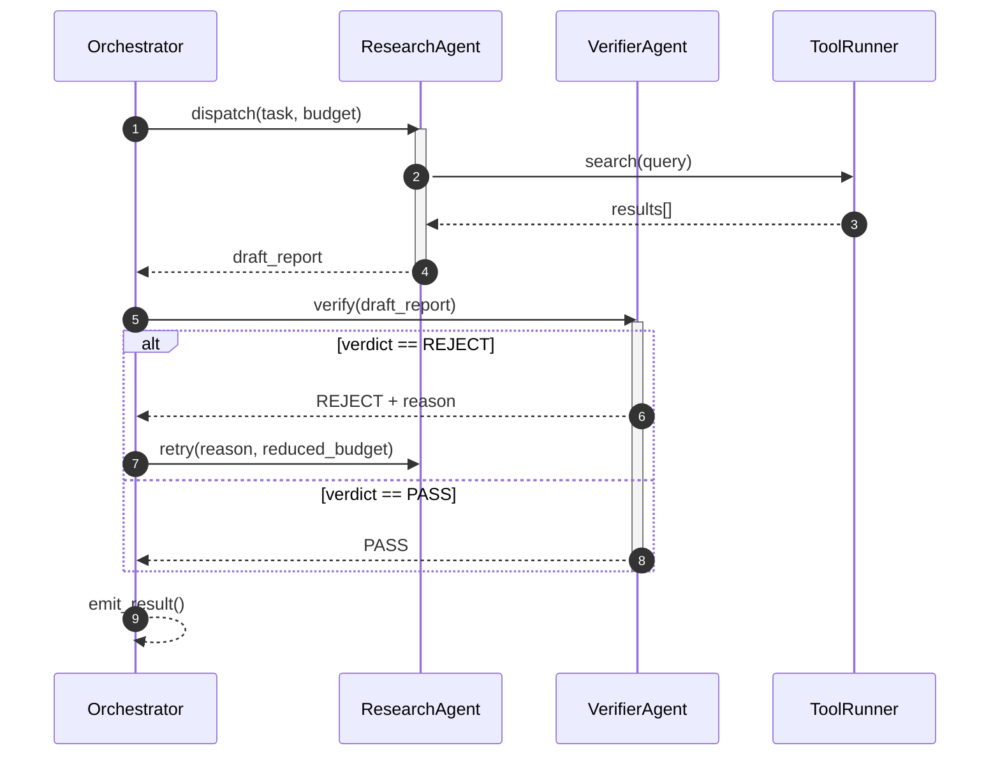
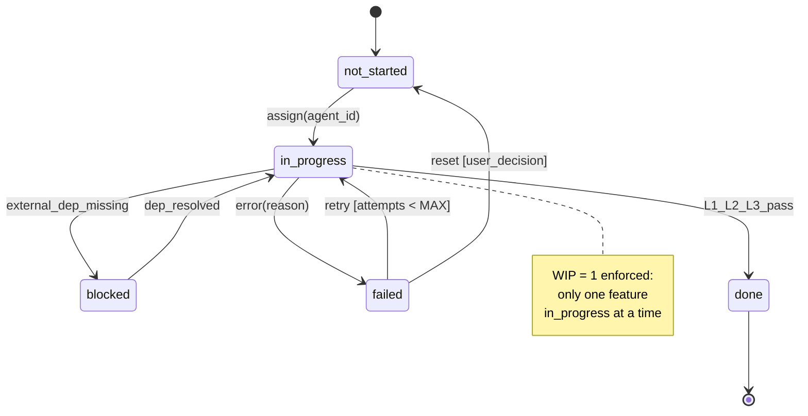
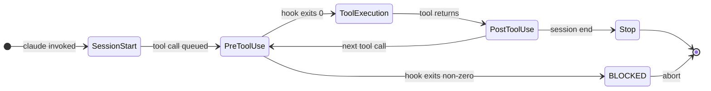
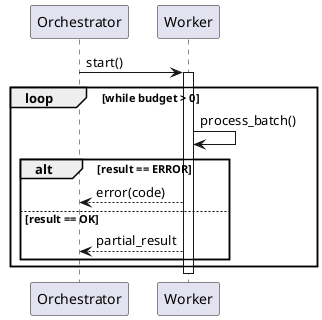

# UML-Driven Agent Development

Model-first approach to agent workflow design: specify behavior as diagrams-as-code before writing implementation, keeping diagrams version-controlled alongside code.

## Key Facts

- Model-Driven Architecture (MDA, OMG 2001) is the formal basis; pragmatic adoption = draw only for hard parts, not the whole system
- Mermaid renders natively in GitHub/GitLab/Notion markdown — no plugin required; diffs cleanly as text
- PlantUML covers all 14 UML 2.x diagram types (timing, profile, composite structure); Mermaid covers ~10
- D2 (2023+) has cleaner layout engine than Mermaid but smaller LLM training corpus
- LLMs generate Mermaid/PlantUML syntax reliably — feed a prompt, get a diff-able diagram
- Store diagrams in `docs/diagrams/` alongside code; validate existence via CI or `init.sh`
- [[agent-design-patterns]] (ReAct, Plan-and-Execute, Reflexion) benefit from sequence + state diagrams during design
- [[agent-orchestration]] graphs (LangGraph nodes/edges) map directly to activity diagrams

## Diagram-to-Agent-Concern Mapping

| Agent concern | Diagram type | What it captures | Tooling fit |
|---|---|---|---|
| Multi-agent message flow | **Sequence** | Lifelines, message order, async awaits, alt/opt/loop fragments | Mermaid `sequenceDiagram` or PlantUML |
| Feature / task lifecycle | **State** | States, guard conditions, entry/exit actions, transitions | Mermaid `stateDiagram-v2` or PlantUML |
| Hook and tool lifecycle | **Activity** | Decision points, parallel forks/joins, swimlanes per agent | PlantUML (swimlane support) |
| Memory layer hierarchy | **Package / Component** | Layer nesting, dependency arrows, namespace boundaries | PlantUML or C4 Component |
| Service topology (MCPs, APIs) | **Deployment / C4** | Nodes, artifacts, communication paths, trust boundaries | Structurizr DSL or PlantUML |
| Actor scope discovery | **Use Case** | Actors, include/extend, acceptance criteria derivation | PlantUML |
| Data schema before code | **Class** | Types, fields, multiplicities, associations | Mermaid `classDiagram` or PlantUML |
| Time-critical protocol | **Timing** | Lifeline state over clock axis, signal transitions | PlantUML only (Mermaid lacks timing) |

**Not worth diagramming:** trivial functions, single-file scripts, hot fixes, exploratory code.

## Mermaid Examples

### Multi-Agent Coordination — sequenceDiagram



### Feature/Task State Machine — stateDiagram-v2



### Hook Lifecycle Example — stateDiagram-v2



## Tool Comparison — When to Use Which

| Criterion | Mermaid | PlantUML | D2 | Structurizr (C4) |
|---|---|---|---|---|
| GitHub native render | Yes | No (needs pre-render or plugin) | No | No |
| UML 2.x coverage | ~10 of 14 types | All 14 | ~6 | 4 (C4 levels) |
| Timing diagrams | No | Yes | No | No |
| Profile / stereotype | No | Yes | No | No |
| Swimlane activity | Limited | Full | No | No |
| LLM generation quality | High (large corpus) | High | Medium (smaller corpus) | Medium |
| Layout control | Low (auto) | Medium | High (auto+manual) | Low (auto) |
| Java dependency | No | Yes (local jar) | No | No |
| Diff-ability | Excellent | Excellent | Excellent | Good |
| CI integration | `mmdc` CLI | `plantuml.jar` or server | `d2` CLI | Structurizr CLI |

**Decision rules:**
- Default to **Mermaid** — markdown-native, zero setup, LLM-ready
- Switch to **PlantUML** when: timing diagrams needed, swimlane activity, full UML 2.x profile, enterprise compliance
- Use **D2** when: layout precision matters more than UML compliance (architecture sketches, ERD)
- Use **C4/Structurizr** when: system context and container boundaries are the focus (service architecture, MCP topology)

### PlantUML Sequence Fragment Reference



Fragments available in PlantUML not in Mermaid: `loop`, `opt`, `par`, `break`, `critical`, `ref`.

### Render Pipeline (CI / init.sh)

```bash
# PlantUML batch render (requires plantuml.jar or server)
find docs/diagrams -name "*.puml" | xargs -I{} java -jar plantuml.jar {}

# Mermaid batch render via CLI
find docs/diagrams -name "*.mmd" | xargs -I{} mmdc -i {} -o {}.svg

# Validate all referenced diagrams exist (add to init.sh)
grep -r "docs/diagrams/" . --include="*.md" | \
  grep -oP 'docs/diagrams/[^\s)>"]+' | sort -u | \
  while read f; do [ -f "$f" ] || echo "MISSING: $f"; done
```

## Gotchas

- **Issue:** Mermaid sequence diagram silently drops messages when participant names contain spaces or special characters without quoting. -> **Fix:** Always quote participant aliases: `participant "Tool Runner" as T` or use short aliases with no spaces; test render locally with `mmdc` before committing.

- **Issue:** PlantUML timing diagrams require `@startuml` / `@enduml` plus explicit `robust` or `clock` declarations — LLMs often generate syntactically invalid timing blocks from hallucinated keywords. -> **Fix:** Use the canonical PlantUML timing template: `robust "Signal" as S` + `@S has state1,state2` + `@0 S is state1`; validate with the official PlantUML server at `https://www.plantuml.com/plantuml/uml/` before saving.

- **Issue:** Mermaid `stateDiagram-v2` note syntax (`note right of StateX`) is only valid for top-level states — nested notes inside `state X {}` blocks produce render errors without visible error messages. -> **Fix:** Move notes to top level after the composite state definition, or use PlantUML which has full note placement support.

- **Issue:** D2 auto-layout can place nodes in non-intuitive order when edge direction is bidirectional, making agent flow diagrams hard to read. -> **Fix:** Use `direction: right` or `direction: down` at the diagram root and force grouping with `grid-rows` / `grid-columns` on container nodes.

## See Also

- [[agent-design-patterns]] - ReAct, Plan-and-Execute, Reflexion patterns — these behavioral patterns are the subject of sequence and state diagrams
- [[agent-orchestration]] - LangGraph state graphs and node/edge definitions map directly to activity diagrams
- [[multi-agent-systems]] - Coordinator/Fork/Swarm topologies visualized with sequence + component diagrams
- [[production-patterns]] - Hook lifecycle and tool validation flows modeled with activity diagrams
- OMG UML 2.5.1 specification: https://www.omg.org/spec/UML/2.5.1/
- PlantUML official: https://plantuml.com/
- Mermaid documentation: https://mermaid.js.org/
- C4 Model: https://c4model.com/
- D2 language: https://d2lang.com/
- Diagrams as Code survey: https://modeling-languages.com/text-uml-tools-complete-list/
