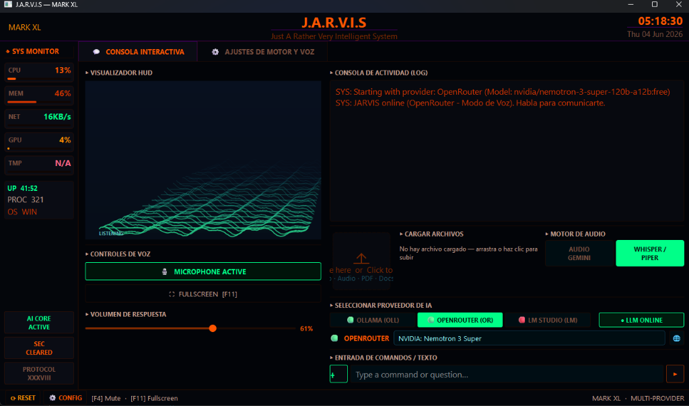
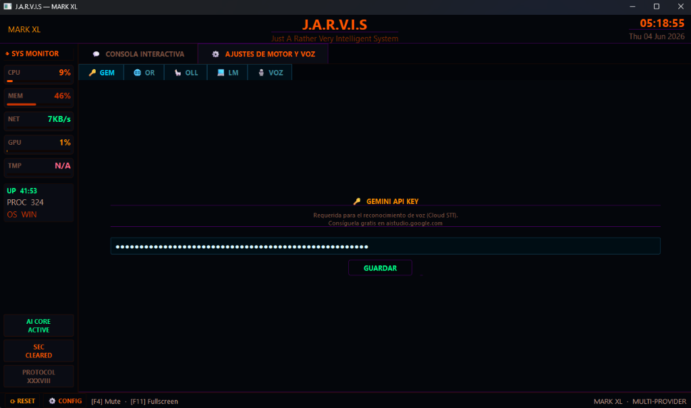
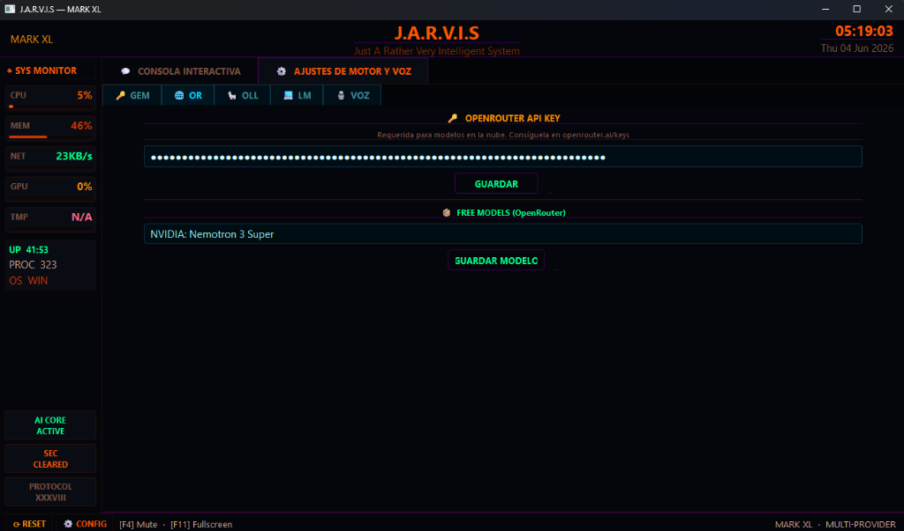
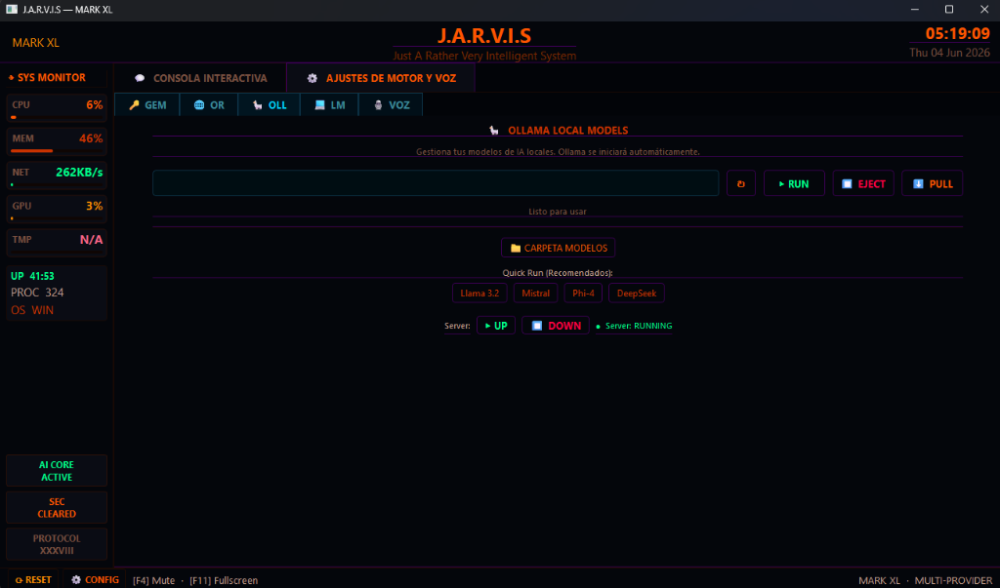
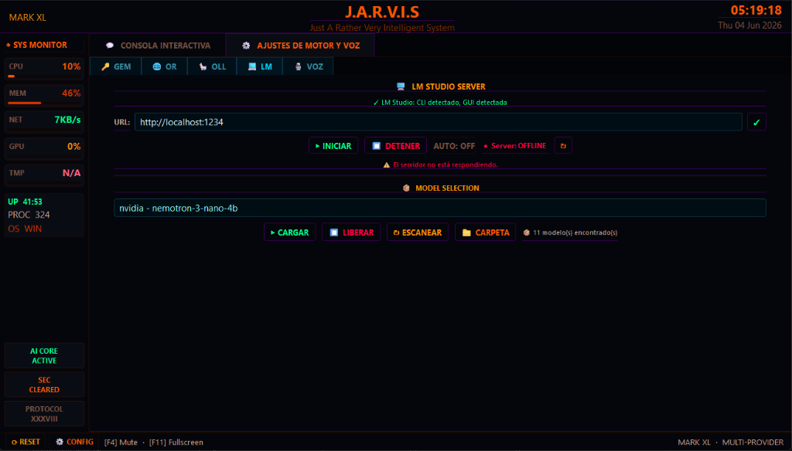
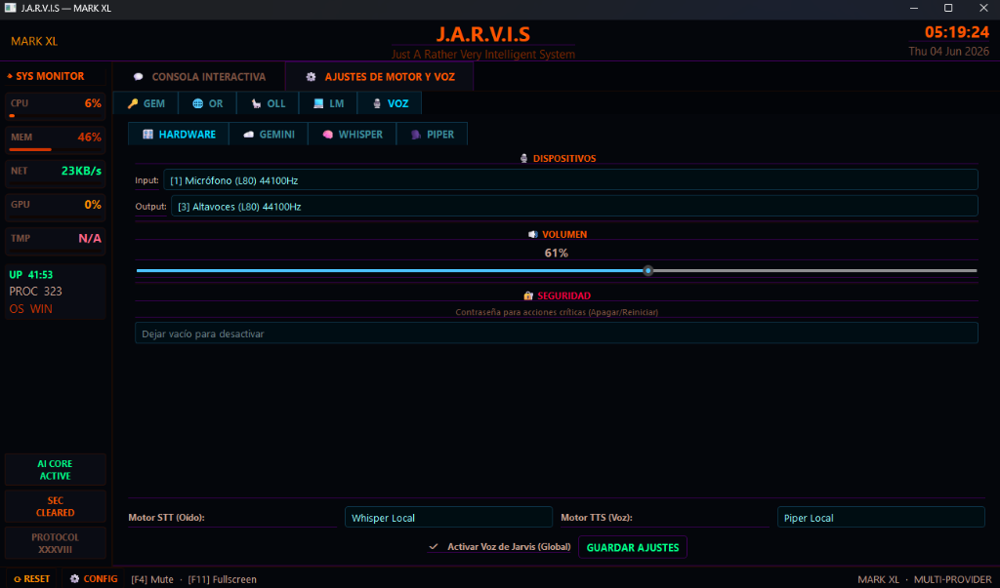

# 🧠 J.A.R.V.I.S. (MARK-40) - Asistente IA Multimodal Cyberpunk

MARK-40 es un asistente virtual multimodal diseñado con una interfaz **Cyberpunk HUD**. Integra soporte para modelos locales (Ollama, LM Studio, Piper, Whisper.cpp) y modelos en la nube (Gemini, OpenRouter) para ofrecer capacidades avanzadas de visión, transcripción y síntesis de voz totalmente personalizables.



## ✨ Características Principales

*   **Multi-Motor de Lenguaje (LLM):** Soporta ejecución local mediante Ollama y LM Studio (usando la CLI oficial `lms`), o a través de la nube usando la API de Gemini y OpenRouter.
*   **Visión Computacional (Ojos):** Capacidad de leer la pantalla actual o ventanas específicas para entender el contexto visual e interactuar contigo sobre lo que estás viendo.
*   **Voz Modular (Oído & Boca):** 
    *   *STT (Transcripción):* Compatible con Whisper.cpp (Local offline) o Gemini (Nube ultrarrápida).
    *   *TTS (Síntesis):* Compatible con Piper (Local offline) o Gemini (Nube).
*   **Auto-Inicio Inteligente:** Si seleccionas un proveedor local como Ollama o LM Studio, el asistente encenderá el servidor en segundo plano automáticamente y cargará el modelo seleccionado por ti al iniciar la aplicación.
*   **Interfaz Cyberpunk Reactiva:** Un diseño tipo HUD semitransparente construido en PyQt6 con animaciones e indicadores de estado interactivos.
*   **Gestión Integrada:** Accesos directos nativos a tus carpetas de modelos, cambio rápido de configuración sin reiniciar y panel centralizado.

---

## ⚙️ Configuración de los Motores

El panel de configuración centralizado (ajustes de motor y voz) te permite activar e inicializar cada uno de los proveedores:

| 🔑 Gemini (GEM) | 🌐 OpenRouter (OR) |
|---|---|
|  |  |
| Conexión con la API oficial de Google Gemini para transcripción y texto. | Acceso a modelos en la nube de OpenRouter, incluyendo selección de modelos gratuitos. |

| 🦙 Ollama (OLL) | 💻 LM Studio (LM) |
|---|---|
|  |  |
| Gestión de modelos locales de Ollama con soporte de descargas (Pull), carga y parada de servicio. | Gestión mediante la CLI oficial de LM Studio (`lms`) con soporte de auto-inicio del servidor y carga dinámica. |

### 🔊 Ajustes de Motor y Voz (Hardware, Whisper, Piper)

Esta sección unifica la configuración de audio, transcripción local y síntesis de voz offline, además de controles de volumen y seguridad:

| 🔊 Ajustes de Motor y Voz |
|---|
|  |
| Permite seleccionar los dispositivos de audio (micrófono y altavoces), ajustar el volumen del sistema, configurar una contraseña de seguridad para acciones críticas y seleccionar los motores de entrada (STT Whisper) y salida (TTS Piper) con auto-guardado en tiempo real. |

---

## 🛠 Instalación y Lanzamiento

### 🪟 Windows (Click & Play / Terminal)
1. **Clona o descarga este repositorio e ingresa a la carpeta:**
   ```bash
   git clone https://github.com/vmmm25/mk-40-mvp1.2.git
   cd mk-40-mvp1.2
   ```
2. **Ejecuta el script de inicio:**
   Haz doble clic sobre el archivo **`Run_JARVIS.bat`** o ejecútalo mediante la consola de comandos (CMD):
   ```cmd
   Run_JARVIS.bat
   ```
   *(El script detectará si es tu primera vez, configurará el entorno virtual Python, instalará las dependencias necesarias y abrirá el Asistente automáticamente).*

---

### 🐧 Linux Ubuntu / Debian (Línea de Comandos)

> [!IMPORTANT]
> **Nota de Entorno:** El soporte para Linux nativo está enfocado a entornos de **pruebas y desarrollo**. Para despliegues generales o entornos estables, se recomienda utilizar **WSL (Windows Subsystem for Linux)** en Windows, o desplegar mediante **Docker** (utilizando el `Dockerfile` y `docker-compose.yml` provistos en el repositorio).

1. **Instala las dependencias necesarias del sistema:**
   Para soportar audio local (Whisper, Piper), interfaz gráfica (PyQt6) y controladores multimedia, ejecuta:
   ```bash
   sudo apt update && sudo apt install -y xdg-utils pulseaudio-utils network-manager wmctrl libportaudio2 build-essential
   ```
2. **Clona el repositorio e ingresa a la carpeta:**
   ```bash
   git clone https://github.com/vmmm25/mk-40-mvp1.2.git
   cd mk-40-mvp1.2
   ```
3. **Asigna permisos de ejecución y lanza el launcher Bash:**
   ```bash
   chmod +x Run_JARVIS.sh
   ./Run_JARVIS.sh
   ```
   *(El launcher configurará el entorno virtual `.venv`, compilará Whisper.cpp nativamente para optimizar el rendimiento y descargará los binarios de Piper y modelos locales para español).*

## 🚀 Uso Avanzado

Al iniciar por primera vez, verás el panel de configuración (engranaje inferior derecho). Desde allí podrás:
- Conectar tu API Key de Gemini u OpenRouter.
- Configurar tus motores locales y enlazar tu servidor (Ollama/LM Studio).
- Especificar la ruta a los ejecutables locales de Whisper y Piper si deseas tener control total por Voz Offline.

## 📦 Motores Locales Soportados

Para utilizar a JARVIS sin conexión a internet (100% privado), te recomendamos descargar e integrar los siguientes motores:

- [Ollama](https://ollama.com/) (Ejecución de modelos de lenguaje).
- [LM Studio](https://lmstudio.ai/) (Servidor OpenAI-compatible y gestor CLI `lms`).
- [Whisper.cpp](https://github.com/ggerganov/whisper.cpp) (Transcripción de voz).
- [Piper](https://github.com/rhasspy/piper) (Síntesis de voz).

## 📝 Changelog

* **[v1.2.1] - LM Studio CLI & Optimización General:**
  * Integración completa con el gestor de CLI oficial `lms` para LM Studio (v0.3+), automatizando la carga/descarga de RAM y el control del servidor daemon en Windows de forma asíncrona.
  * Auto-inicio y auto-carga inteligente de modelos locales al arrancar la app.
  * Se corrigieron errores de endpoints (404 / chat completions) y de namespaces en las peticiones locales.
  * Se eliminaron botones redundantes y se implementó auto-guardado en la UI al cambiar la selección en los comboboxes y modificar URLs.
  * Se optimizó el polling de estado de los servidores en segundo plano (pasa de 3 s a 30 s si el motor está inactivo) para evitar saturación de logs.
  * Se corrigió la creación del entorno virtual y dependencias faltantes (`playwright`, `psutil`, `requests`) para máquinas nuevas.

## 📄 Licencia

Este proyecto se distribuye bajo la Licencia MIT. Eres libre de usarlo, modificarlo y distribuirlo de forma gratuita o comercial.

---
*Si este proyecto te parece útil o interesante, no dudes en dejar una estrella ⭐ en el repositorio.*